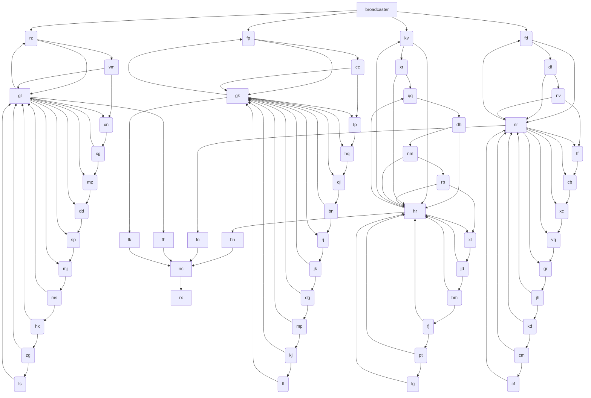

```mermaid
flowchart TD
    broadcaster --> rz
    broadcaster --> fp
    broadcaster --> kv
    broadcaster --> fd
    ls(ls) --> gl
    rz(rz) --> vm
    rz(rz) --> gl
    ql(ql) --> bn
    bm(bm) --> hr
    bm(bm) --> fj
    fp(fp) --> cc
    fp(fp) --> gk
    xg(xg) --> gl
    xg(xg) --> mz
    dg(dg) --> gk
    dg(dg) --> mp
    zg(zg) --> ls
    zg(zg) --> gl
    lg(lg) --> hr
    pt(pt) --> lg
    pt(pt) --> hr
    sp(sp) --> mj
    ms(ms) --> gl
    ms(ms) --> hx
    kj(kj) --> fl
    kj(kj) --> gk
    bn(bn) --> rj
    bn(bn) --> gk
    xc(xc) --> vq
    fl(fl) --> gk
    dh(dh) --> hr
    dh(dh) --> nm
    jk(jk) --> gk
    jk(jk) --> dg
    tf(tf) --> cb
    kd(kd) --> cm
    kd(kd) --> nr
    kv(kv) --> xr
    kv(kv) --> hr
    hq(hq) --> ql
    vm(vm) --> gl
    vm(vm) --> xn
    jh(jh) --> nr
    jh(jh) --> kd
    mz(mz) --> dd
    tp(tp) --> hq
    cf(cf) --> nr
    gr(gr) --> jh
    jd(jd) --> hr
    jd(jd) --> bm
    xr(xr) --> qq
    xr(xr) --> hr
    cm(cm) --> nr
    cm(cm) --> cf
    rb(rb) --> xl
    rb(rb) --> hr
    mp(mp) --> gk
    mp(mp) --> kj
    rj(rj) --> jk
    fd(fd) --> nr
    fd(fd) --> df
    fj(fj) --> pt
    fj(fj) --> hr
    qq(qq) --> dh
    df(df) --> nr
    df(df) --> nv
    mj(mj) --> ms
    xn(xn) --> xg
    cc(cc) --> gk
    cc(cc) --> tp
    nm(nm) --> rb
    nm(nm) --> hr
    dd(dd) --> sp
    vq(vq) --> gr
    cb(cb) --> xc
    nv(nv) --> tf
    nv(nv) --> nr
    xl(xl) --> jd
    hx(hx) --> gl
    hx(hx) --> zg
    gl[gl] --> fh
    gl[gl] --> xn
    gl[gl] --> sp
    gl[gl] --> mz
    gl[gl] --> rz
    gl[gl] --> mj
    gl[gl] --> dd
    hr[hr] --> hh
    hr[hr] --> kv
    hr[hr] --> xl
    hr[hr] --> qq
    gk[gk] --> lk
    gk[gk] --> tp
    gk[gk] --> fp
    gk[gk] --> ql
    gk[gk] --> hq
    gk[gk] --> rj
    nc[nc] --> rx
    nr[nr] --> fd
    nr[nr] --> gr
    nr[nr] --> fn
    nr[nr] --> cb
    nr[nr] --> tf
    nr[nr] --> xc
    nr[nr] --> vq
    hh[hh] --> nc
    fn[fn] --> nc
    fh[fh] --> nc
    lk[lk] --> nc
```
238815727638557
