{'x00': '1', 'x01': '1', 'x02': '1', 'x03': '1', 'x04': '0', 'x05': '1', 'x06': '0', 'x07': '1', 'x08': '0', 'x09': '1', 'x10': '1', 'x11': '1', 'x12': '1', 'x13': '1', 'x14': '1', 'x15': '1', 'x16': '1', 'x17': '1', 'x18': '0', 'x19': '1', 'x20': '1', 'x21': '1', 'x22': '1', 'x23': '1', 'x24': '1', 'x25': '1', 'x26': '0', 'x27': '1', 'x28': '1', 'x29': '1', 'x30': '1', 'x31': '0', 'x32': '1', 'x33': '0', 'x34': '1', 'x35': '0', 'x36': '0', 'x37': '0', 'x38': '1', 'x39': '0', 'x40': '0', 'x41': '1', 'x42': '0', 'x43': '1', 'x44': '1', 'y00': '1', 'y01': '1', 'y02': '1', 'y03': '1', 'y04': '1', 'y05': '0', 'y06': '0', 'y07': '0', 'y08': '0', 'y09': '0', 'y10': '1', 'y11': '0', 'y12': '0', 'y13': '1', 'y14': '1', 'y15': '0', 'y16': '1', 'y17': '0', 'y18': '1', 'y19': '0', 'y20': '1', 'y21': '1', 'y22': '1', 'y23': '1', 'y24': '0', 'y25': '0', 'y26': '0', 'y27': '0', 'y28': '0', 'y29': '0', 'y30': '1', 'y31': '1', 'y32': '0', 'y33': '1', 'y34': '0', 'y35': '1', 'y36': '1', 'y37': '0', 'y38': '0', 'y39': '0', 'y40': '0', 'y41': '1', 'y42': '0', 'y43': '1', 'y44': '1'}
{'gsw': (<built-in function and_>, 'wwv', 'btj'), 'jkc': (<built-in function and_>, 'x29', 'y29'), 'vmg': (<built-in function or_>, 'wjs', 'bgp'), 'cbj': (<built-in function and_>, 'vdw', 'cjv'), 'wkb': (<built-in function xor>, 'x16', 'y16'), 'cdw': (<built-in function xor>, 'x22', 'y22'), 'tsm': (<built-in function and_>, 'x08', 'y08'), 'pss': (<built-in function xor>, 'x41', 'y41'), 'cpn': (<built-in function and_>, 'gnn', 'nsj'), 'cqh': (<built-in function and_>, 'rdb', 'shb'), 'phv': (<built-in function xor>, 'x02', 'y02'), 'hcm': (<built-in function and_>, 'y14', 'x14'), 'fmp': (<built-in function and_>, 'kpc', 'bdq'), 'wqg': (<built-in function and_>, 'qmj', 'tnw'), 'fwq': (<built-in function and_>, 'cdw', 'btq'), 'ptb': (<built-in function xor>, 'x14', 'y14'), 'z35': (<built-in function xor>, 'rgt', 'fwv'), 'vdw': (<built-in function xor>, 'x11', 'y11'), 'z19': (<built-in function xor>, 'dnb', 'svp'), 'prj': (<built-in function xor>, 'x04', 'y04'), 'tsb': (<built-in function xor>, 'y38', 'x38'), 'z26': (<built-in function xor>, 'bws', 'rts'), 'jpn': (<built-in function and_>, 'kvb', 'ptb'), 'qrs': (<built-in function and_>, 'x05', 'y05'), 'tpt': (<built-in function and_>, 'wtc', 'nhh'), 'z08': (<built-in function xor>, 'pwg', 'bdf'), 'vcj': (<built-in function xor>, 'y06', 'x06'), 'z36': (<built-in function xor>, 'rvm', 'nmb'), 'pvr': (<built-in function xor>, 'x23', 'y23'), 'hmv': (<built-in function and_>, 'x37', 'y37'), 'z01': (<built-in function xor>, 'dhb', 'qpp'), 'crj': (<built-in function and_>, 'y28', 'x28'), 'pfs': (<built-in function and_>, 'x42', 'y42'), 'z27': (<built-in function and_>, 'x27', 'y27'), 'z30': (<built-in function xor>, 'qkp', 'hqs'), 'gvb': (<built-in function or_>, 'mtn', 'fwq'), 'shm': (<built-in function xor>, 'y24', 'x24'), 'bws': (<built-in function xor>, 'y26', 'x26'), 'z07': (<built-in function and_>, 'gnj', 'scw'), 'qmj': (<built-in function xor>, 'y09', 'x09'), 'kpc': (<built-in function xor>, 'x21', 'y21'), 'hcj': (<built-in function or_>, 'gwp', 'pvk'), 'rns': (<built-in function and_>, 'hfw', 'hcj'), 'vnb': (<built-in function or_>, 'ndg', 'pbr'), 'gvf': (<built-in function xor>, 'y32', 'x32'), 'z28': (<built-in function xor>, 'wwv', 'btj'), 'sfg': (<built-in function and_>, 'dgr', 'dhp'), 'hsn': (<built-in function and_>, 'x31', 'y31'), 'twp': (<built-in function and_>, 'stb', 'nwc'), 'bdf': (<built-in function or_>, 'dvq', 'shj'), 'z37': (<built-in function xor>, 'nfb', 'vwq'), 'z42': (<built-in function xor>, 'nsj', 'gnn'), 'jsj': (<built-in function and_>, 'hjh', 'cqj'), 'hrc': (<built-in function or_>, 'rsj', 'cvk'), 'tgc': (<built-in function xor>, 'y15', 'x15'), 'wtc': (<built-in function or_>, 'kng', 'rkh'), 'z25': (<built-in function xor>, 'hcj', 'hfw'), 'mgc': (<built-in function or_>, 'khs', 'hwm'), 'jwb': (<built-in function and_>, 'x23', 'y23'), 'tnw': (<built-in function or_>, 'khj', 'tsm'), 'hdp': (<built-in function and_>, 'x36', 'y36'), 'cjv': (<built-in function or_>, 'hns', 'sfg'), 'wwv': (<built-in function or_>, 'gtc', 'kcd'), 'fdp': (<built-in function or_>, 'hqf', 'wtb'), 'kcd': (<built-in function xor>, 'vpt', 'hdg'), 'ghw': (<built-in function and_>, 'qpd', 'vcj'), 'z44': (<built-in function xor>, 'pfm', 'jcr'), 'wjs': (<built-in function and_>, 'msw', 'ffd'), 'stb': (<built-in function or_>, 'dhh', 'vdq'), 'nwc': (<built-in function xor>, 'y05', 'x05'), 'rvm': (<built-in function xor>, 'x36', 'y36'), 'dvq': (<built-in function and_>, 'x07', 'y07'), 'vbp': (<built-in function and_>, 'x32', 'y32'), 'nsj': (<built-in function or_>, 'vdc', 'bhj'), 'wvb': (<built-in function and_>, 'x26', 'y26'), 'dhb': (<built-in function and_>, 'y00', 'x00'), 'z38': (<built-in function xor>, 'dhf', 'tsb'), 'z40': (<built-in function xor>, 'fdp', 'cjs'), 'wfd': (<built-in function and_>, 'x03', 'y03'), 'z24': (<built-in function xor>, 'pfn', 'shm'), 'gdq': (<built-in function xor>, 'y39', 'x39'), 'vwq': (<built-in function xor>, 'y37', 'x37'), 'hdg': (<built-in function or_>, 'mhk', 'wvb'), 'btg': (<built-in function and_>, 'y44', 'x44'), 'z39': (<built-in function xor>, 'mgc', 'gdq'), 'cgc': (<built-in function and_>, 'nmb', 'rvm'), 'wvj': (<built-in function and_>, 'y30', 'x30'), 'rpw': (<built-in function and_>, 'y35', 'x35'), 'kqr': (<built-in function and_>, 'hbd', 'vnm'), 'mdt': (<built-in function or_>, 'hcm', 'jpn'), 'z33': (<built-in function xor>, 'ffd', 'msw'), 'z09': (<built-in function xor>, 'tnw', 'qmj'), 'scw': (<built-in function xor>, 'x07', 'y07'), 'dhf': (<built-in function or_>, 'rsd', 'hmv'), 'gtc': (<built-in function and_>, 'vpt', 'hdg'), 'spb': (<built-in function or_>, 'hsn', 'jsj'), 'ffd': (<built-in function or_>, 'vbp', 'nmd'), 'khj': (<built-in function and_>, 'bdf', 'pwg'), 'bdq': (<built-in function or_>, 'fdm', 'cgp'), 'vdq': (<built-in function and_>, 'x04', 'y04'), 'pwg': (<built-in function xor>, 'x08', 'y08'), 'nsk': (<built-in function and_>, 'hpn', 'kgf'), 'z23': (<built-in function or_>, 'jwb', 'hjp'), 'dhh': (<built-in function and_>, 'rmv', 'prj'), 'z14': (<built-in function xor>, 'ptb', 'kvb'), 'btj': (<built-in function xor>, 'x28', 'y28'), 'rdb': (<built-in function or_>, 'crj', 'gsw'), 'rmv': (<built-in function or_>, 'tpt', 'wfd'), 'vpt': (<built-in function xor>, 'x27', 'y27'), 'z06': (<built-in function xor>, 'qpd', 'vcj'), 'pbr': (<built-in function and_>, 'y01', 'x01'), 'hvr': (<built-in function and_>, 'x17', 'y17'), 'z13': (<built-in function xor>, 'hfb', 'bbg'), 'z00': (<built-in function xor>, 'y00', 'x00'), 'gnn': (<built-in function xor>, 'x42', 'y42'), 'khs': (<built-in function and_>, 'dhf', 'tsb'), 'z18': (<built-in function xor>, 'jsr', 'cqk'), 'rgt': (<built-in function xor>, 'y35', 'x35'), 'qvd': (<built-in function and_>, 'x15', 'y15'), 'nhh': (<built-in function xor>, 'x03', 'y03'), 'ndg': (<built-in function and_>, 'qpp', 'dhb'), 'gtf': (<built-in function and_>, 'y34', 'x34'), 'kgf': (<built-in function xor>, 'y43', 'x43'), 'hfw': (<built-in function xor>, 'x25', 'y25'), 'svp': (<built-in function or_>, 'tnj', 'wbv'), 'kng': (<built-in function and_>, 'x02', 'y02'), 'vdc': (<built-in function and_>, 'hrc', 'pss'), 'ngf': (<built-in function or_>, 'kqb', 'qvd'), 'mhk': (<built-in function and_>, 'rts', 'bws'), 'z29': (<built-in function xor>, 'shb', 'rdb'), 'dgr': (<built-in function or_>, 'ndv', 'wqg'), 'z45': (<built-in function or_>, 'wmr', 'btg'), 'tpv': (<built-in function and_>, 'qmd', 'hvb'), 'pfn': (<built-in function xor>, 'gvb', 'pvr'), 'pvk': (<built-in function and_>, 'x24', 'y24'), 'hqf': (<built-in function and_>, 'gdq', 'mgc'), 'gsh': (<built-in function and_>, 'x11', 'y11'), 'cqk': (<built-in function xor>, 'y18', 'x18'), 'fwv': (<built-in function or_>, 'csj', 'gtf'), 'gkq': (<built-in function and_>, 'x19', 'y19'), 'z10': (<built-in function xor>, 'dgr', 'dhp'), 'z17': (<built-in function xor>, 'hbd', 'vnm'), 'qqn': (<built-in function and_>, 'dnb', 'svp'), 'kqb': (<built-in function and_>, 'mdt', 'tgc'), 'z04': (<built-in function xor>, 'rmv', 'prj'), 'hns': (<built-in function and_>, 'y10', 'x10'), 'dgf': (<built-in function and_>, 'qkp', 'hqs'), 'hpn': (<built-in function or_>, 'pfs', 'cpn'), 'rsj': (<built-in function and_>, 'cjs', 'fdp'), 'jdm': (<built-in function and_>, 'rgt', 'fwv'), 'dnm': (<built-in function and_>, 'y21', 'x21'), 'nfb': (<built-in function or_>, 'cgc', 'hdp'), 'dgt': (<built-in function and_>, 'y12', 'x12'), 'wtb': (<built-in function and_>, 'x39', 'y39'), 'z15': (<built-in function xor>, 'mdt', 'tgc'), 'z16': (<built-in function xor>, 'ngf', 'tpk'), 'wbv': (<built-in function and_>, 'jsr', 'cqk'), 'tpk': (<built-in function and_>, 'y16', 'x16'), 'vsb': (<built-in function and_>, 'x06', 'y06'), 'bhj': (<built-in function and_>, 'y41', 'x41'), 'qpp': (<built-in function xor>, 'x01', 'y01'), 'z21': (<built-in function xor>, 'kpc', 'bdq'), 'z03': (<built-in function xor>, 'wtc', 'nhh'), 'gnj': (<built-in function or_>, 'ghw', 'vsb'), 'shb': (<built-in function xor>, 'x29', 'y29'), 'jdd': (<built-in function and_>, 'y13', 'x13'), 'z41': (<built-in function xor>, 'hrc', 'pss'), 'nsw': (<built-in function xor>, 'y20', 'x20'), 'qmd': (<built-in function xor>, 'x12', 'y12'), 'hvb': (<built-in function or_>, 'cbj', 'gsh'), 'pfm': (<built-in function xor>, 'x44', 'y44'), 'mtn': (<built-in function and_>, 'y22', 'x22'), 'z02': (<built-in function xor>, 'vnb', 'phv'), 'bgp': (<built-in function and_>, 'y33', 'x33'), 'mmf': (<built-in function and_>, 'y25', 'x25'), 'rkh': (<built-in function and_>, 'phv', 'vnb'), 'dhp': (<built-in function xor>, 'x10', 'y10'), 'cgp': (<built-in function and_>, 'wdp', 'nsw'), 'hjp': (<built-in function and_>, 'gvb', 'pvr'), 'csj': (<built-in function and_>, 'vmg', 'rsm'), 'ndv': (<built-in function and_>, 'y09', 'x09'), 'kvb': (<built-in function or_>, 'nwq', 'jdd'), 'cjs': (<built-in function xor>, 'x40', 'y40'), 'hjh': (<built-in function xor>, 'x31', 'y31'), 'wmr': (<built-in function and_>, 'pfm', 'jcr'), 'hfb': (<built-in function xor>, 'x13', 'y13'), 'hqs': (<built-in function or_>, 'jkc', 'cqh'), 'btq': (<built-in function or_>, 'dnm', 'fmp'), 'qpd': (<built-in function or_>, 'qrs', 'twp'), 'z34': (<built-in function xor>, 'rsm', 'vmg'), 'shj': (<built-in function xor>, 'gnj', 'scw'), 'z12': (<built-in function xor>, 'qmd', 'hvb'), 'cqj': (<built-in function or_>, 'wvj', 'dgf'), 'vnm': (<built-in function xor>, 'y17', 'x17'), 'fdm': (<built-in function and_>, 'x20', 'y20'), 'gwp': (<built-in function and_>, 'pfn', 'shm'), 'z05': (<built-in function xor>, 'stb', 'nwc'), 'tnj': (<built-in function and_>, 'x18', 'y18'), 'nmd': (<built-in function and_>, 'spb', 'gvf'), 'rsd': (<built-in function and_>, 'vwq', 'nfb'), 'nwq': (<built-in function and_>, 'bbg', 'hfb'), 'cwf': (<built-in function and_>, 'x43', 'y43'), 'cvk': (<built-in function and_>, 'x40', 'y40'), 'z32': (<built-in function xor>, 'spb', 'gvf'), 'rsm': (<built-in function xor>, 'x34', 'y34'), 'rts': (<built-in function or_>, 'rns', 'mmf'), 'msw': (<built-in function xor>, 'y33', 'x33'), 'bfn': (<built-in function and_>, 'tpk', 'ngf'), 'wdp': (<built-in function or_>, 'qqn', 'gkq'), 'jcr': (<built-in function or_>, 'cwf', 'nsk'), 'dnb': (<built-in function xor>, 'y19', 'x19'), 'qkp': (<built-in function xor>, 'y30', 'x30'), 'jsr': (<built-in function or_>, 'hvr', 'kqr'), 'z20': (<built-in function xor>, 'wdp', 'nsw'), 'z22': (<built-in function xor>, 'btq', 'cdw'), 'z43': (<built-in function xor>, 'kgf', 'hpn'), 'hwm': (<built-in function and_>, 'y38', 'x38'), 'nmb': (<built-in function or_>, 'rpw', 'jdm'), 'z11': (<built-in function xor>, 'cjv', 'vdw'), 'z31': (<built-in function xor>, 'hjh', 'cqj'), 'hbd': (<built-in function or_>, 'wkb', 'bfn'), 'bbg': (<built-in function or_>, 'tpv', 'dgt')}
57588078109518

```mermaid
flowchart TD
    tpv(tpv) -->|OR| bbg(bbg)
    dgt(dgt) -->|OR| bbg(bbg)
    dvq(dvq) -->|OR| bdf(bdf)
    shj(shj) -->|OR| bdf(bdf)
    fdm(fdm) -->|OR| bdq(bdq)
    cgp(cgp) -->|OR| bdq(bdq)
    tpk(tpk) -->|AND| bfn(bfn)
    ngf(ngf) -->|AND| bfn(bfn)
    y33(y33) -->|AND| bgp(bgp)
    x33(x33) -->|AND| bgp(bgp)
    y41(y41) -->|AND| bhj(bhj)
    x41(x41) -->|AND| bhj(bhj)
    y44(y44) -->|AND| btg(btg)
    x44(x44) -->|AND| btg(btg)
    x28(x28) -->|XOR| btj(btj)
    y28(y28) -->|XOR| btj(btj)
    dnm(dnm) -->|OR| btq(btq)
    fmp(fmp) -->|OR| btq(btq)
    y26(y26) -->|XOR| bws(bws)
    x26(x26) -->|XOR| bws(bws)
    vdw(vdw) -->|AND| cbj(cbj)
    cjv(cjv) -->|AND| cbj(cbj)
    x22(x22) -->|XOR| cdw(cdw)
    y22(y22) -->|XOR| cdw(cdw)
    nmb(nmb) -->|AND| cgc(cgc)
    rvm(rvm) -->|AND| cgc(cgc)
    wdp(wdp) -->|AND| cgp(cgp)
    nsw(nsw) -->|AND| cgp(cgp)
    x40(x40) -->|XOR| cjs(cjs)
    y40(y40) -->|XOR| cjs(cjs)
    hns(hns) -->|OR| cjv(cjv)
    sfg(sfg) -->|OR| cjv(cjv)
    gnn(gnn) -->|AND| cpn(cpn)
    nsj(nsj) -->|AND| cpn(cpn)
    rdb(rdb) -->|AND| cqh(cqh)
    shb(shb) -->|AND| cqh(cqh)
    wvj(wvj) -->|OR| cqj(cqj)
    dgf(dgf) -->|OR| cqj(cqj)
    y18(y18) -->|XOR| cqk(cqk)
    x18(x18) -->|XOR| cqk(cqk)
    y28(y28) -->|AND| crj(crj)
    x28(x28) -->|AND| crj(crj)
    vmg(vmg) -->|AND| csj(csj)
    rsm(rsm) -->|AND| csj(csj)
    x40(x40) -->|AND| cvk(cvk)
    y40(y40) -->|AND| cvk(cvk)
    x43(x43) -->|AND| cwf(cwf)
    y43(y43) -->|AND| cwf(cwf)
    qkp(qkp) -->|AND| dgf(dgf)
    hqs(hqs) -->|AND| dgf(dgf)
    ndv(ndv) -->|OR| dgr(dgr)
    wqg(wqg) -->|OR| dgr(dgr)
    y12(y12) -->|AND| dgt(dgt)
    x12(x12) -->|AND| dgt(dgt)
    y00(y00) -->|AND| dhb(dhb)
    x00(x00) -->|AND| dhb(dhb)
    rsd(rsd) -->|OR| dhf(dhf)
    hmv(hmv) -->|OR| dhf(dhf)
    rmv(rmv) -->|AND| dhh(dhh)
    prj(prj) -->|AND| dhh(dhh)
    x10(x10) -->|XOR| dhp(dhp)
    y10(y10) -->|XOR| dhp(dhp)
    y19(y19) -->|XOR| dnb(dnb)
    x19(x19) -->|XOR| dnb(dnb)
    y21(y21) -->|AND| dnm(dnm)
    x21(x21) -->|AND| dnm(dnm)
    x07(x07) -->|AND| dvq(dvq)
    y07(y07) -->|AND| dvq(dvq)
    x20(x20) -->|AND| fdm(fdm)
    y20(y20) -->|AND| fdm(fdm)
    hqf(hqf) -->|OR| fdp(fdp)
    wtb(wtb) -->|OR| fdp(fdp)
    vbp(vbp) -->|OR| ffd(ffd)
    nmd(nmd) -->|OR| ffd(ffd)
    kpc(kpc) -->|AND| fmp(fmp)
    bdq(bdq) -->|AND| fmp(fmp)
    cdw(cdw) -->|AND| fwq(fwq)
    btq(btq) -->|AND| fwq(fwq)
    csj(csj) -->|OR| fwv(fwv)
    gtf(gtf) -->|OR| fwv(fwv)
    y39(y39) -->|XOR| gdq(gdq)
    x39(x39) -->|XOR| gdq(gdq)
    qpd(qpd) -->|AND| ghw(ghw)
    vcj(vcj) -->|AND| ghw(ghw)
    x19(x19) -->|AND| gkq(gkq)
    y19(y19) -->|AND| gkq(gkq)
    ghw(ghw) -->|OR| gnj(gnj)
    vsb(vsb) -->|OR| gnj(gnj)
    x42(x42) -->|XOR| gnn(gnn)
    y42(y42) -->|XOR| gnn(gnn)
    x11(x11) -->|AND| gsh(gsh)
    y11(y11) -->|AND| gsh(gsh)
    wwv(wwv) -->|AND| gsw(gsw)
    btj(btj) -->|AND| gsw(gsw)
    vpt(vpt) -->|AND| gtc(gtc)
    hdg(hdg) -->|AND| gtc(gtc)
    y34(y34) -->|AND| gtf(gtf)
    x34(x34) -->|AND| gtf(gtf)
    mtn(mtn) -->|OR| gvb(gvb)
    fwq(fwq) -->|OR| gvb(gvb)
    y32(y32) -->|XOR| gvf(gvf)
    x32(x32) -->|XOR| gvf(gvf)
    pfn(pfn) -->|AND| gwp(gwp)
    shm(shm) -->|AND| gwp(gwp)
    wkb(wkb) -->|OR| hbd(hbd)
    bfn(bfn) -->|OR| hbd(hbd)
    gwp(gwp) -->|OR| hcj(hcj)
    pvk(pvk) -->|OR| hcj(hcj)
    y14(y14) -->|AND| hcm(hcm)
    x14(x14) -->|AND| hcm(hcm)
    mhk(mhk) -->|OR| hdg(hdg)
    wvb(wvb) -->|OR| hdg(hdg)
    x36(x36) -->|AND| hdp(hdp)
    y36(y36) -->|AND| hdp(hdp)
    x13(x13) -->|XOR| hfb(hfb)
    y13(y13) -->|XOR| hfb(hfb)
    x25(x25) -->|XOR| hfw(hfw)
    y25(y25) -->|XOR| hfw(hfw)
    x31(x31) -->|XOR| hjh(hjh)
    y31(y31) -->|XOR| hjh(hjh)
    gvb(gvb) -->|AND| hjp(hjp)
    pvr(pvr) -->|AND| hjp(hjp)
    x37(x37) -->|AND| hmv(hmv)
    y37(y37) -->|AND| hmv(hmv)
    y10(y10) -->|AND| hns(hns)
    x10(x10) -->|AND| hns(hns)
    pfs(pfs) -->|OR| hpn(hpn)
    cpn(cpn) -->|OR| hpn(hpn)
    gdq(gdq) -->|AND| hqf(hqf)
    mgc(mgc) -->|AND| hqf(hqf)
    jkc(jkc) -->|OR| hqs(hqs)
    cqh(cqh) -->|OR| hqs(hqs)
    rsj(rsj) -->|OR| hrc(hrc)
    cvk(cvk) -->|OR| hrc(hrc)
    x31(x31) -->|AND| hsn(hsn)
    y31(y31) -->|AND| hsn(hsn)
    cbj(cbj) -->|OR| hvb(hvb)
    gsh(gsh) -->|OR| hvb(hvb)
    x17(x17) -->|AND| hvr(hvr)
    y17(y17) -->|AND| hvr(hvr)
    y38(y38) -->|AND| hwm(hwm)
    x38(x38) -->|AND| hwm(hwm)
    cwf(cwf) -->|OR| jcr(jcr)
    nsk(nsk) -->|OR| jcr(jcr)
    y13(y13) -->|AND| jdd(jdd)
    x13(x13) -->|AND| jdd(jdd)
    rgt(rgt) -->|AND| jdm(jdm)
    fwv(fwv) -->|AND| jdm(jdm)
    x29(x29) -->|AND| jkc(jkc)
    y29(y29) -->|AND| jkc(jkc)
    kvb(kvb) -->|AND| jpn(jpn)
    ptb(ptb) -->|AND| jpn(jpn)
    hjh(hjh) -->|AND| jsj(jsj)
    cqj(cqj) -->|AND| jsj(jsj)
    hvr(hvr) -->|OR| jsr(jsr)
    kqr(kqr) -->|OR| jsr(jsr)
    x23(x23) -->|AND| jwb(jwb)
    y23(y23) -->|AND| jwb(jwb)
    x27(x27) -->|AND| kcd(kcd)
    y27(y27) -->|AND| kcd(kcd)
    y43(y43) -->|XOR| kgf(kgf)
    x43(x43) -->|XOR| kgf(kgf)
    bdf(bdf) -->|AND| khj(khj)
    pwg(pwg) -->|AND| khj(khj)
    dhf(dhf) -->|AND| khs(khs)
    tsb(tsb) -->|AND| khs(khs)
    x02(x02) -->|AND| kng(kng)
    y02(y02) -->|AND| kng(kng)
    x21(x21) -->|XOR| kpc(kpc)
    y21(y21) -->|XOR| kpc(kpc)
    mdt(mdt) -->|AND| kqb(kqb)
    tgc(tgc) -->|AND| kqb(kqb)
    hbd(hbd) -->|AND| kqr(kqr)
    vnm(vnm) -->|AND| kqr(kqr)
    nwq(nwq) -->|OR| kvb(kvb)
    jdd(jdd) -->|OR| kvb(kvb)
    hcm(hcm) -->|OR| mdt(mdt)
    jpn(jpn) -->|OR| mdt(mdt)
    khs(khs) -->|OR| mgc(mgc)
    hwm(hwm) -->|OR| mgc(mgc)
    rts(rts) -->|AND| mhk(mhk)
    bws(bws) -->|AND| mhk(mhk)
    y25(y25) -->|AND| mmf(mmf)
    x25(x25) -->|AND| mmf(mmf)
    y33(y33) -->|XOR| msw(msw)
    x33(x33) -->|XOR| msw(msw)
    y22(y22) -->|AND| mtn(mtn)
    x22(x22) -->|AND| mtn(mtn)
    qpp(qpp) -->|AND| ndg(ndg)
    dhb(dhb) -->|AND| ndg(ndg)
    y09(y09) -->|AND| ndv(ndv)
    x09(x09) -->|AND| ndv(ndv)
    cgc(cgc) -->|OR| nfb(nfb)
    hdp(hdp) -->|OR| nfb(nfb)
    kqb(kqb) -->|OR| ngf(ngf)
    qvd(qvd) -->|OR| ngf(ngf)
    x03(x03) -->|XOR| nhh(nhh)
    y03(y03) -->|XOR| nhh(nhh)
    rpw(rpw) -->|OR| nmb(nmb)
    jdm(jdm) -->|OR| nmb(nmb)
    spb(spb) -->|AND| nmd(nmd)
    gvf(gvf) -->|AND| nmd(nmd)
    vdc(vdc) -->|OR| nsj(nsj)
    bhj(bhj) -->|OR| nsj(nsj)
    hpn(hpn) -->|AND| nsk(nsk)
    kgf(kgf) -->|AND| nsk(nsk)
    y20(y20) -->|XOR| nsw(nsw)
    x20(x20) -->|XOR| nsw(nsw)
    y05(y05) -->|XOR| nwc(nwc)
    x05(x05) -->|XOR| nwc(nwc)
    bbg(bbg) -->|AND| nwq(nwq)
    hfb(hfb) -->|AND| nwq(nwq)
    y01(y01) -->|AND| pbr(pbr)
    x01(x01) -->|AND| pbr(pbr)
    x44(x44) -->|XOR| pfm(pfm)
    y44(y44) -->|XOR| pfm(pfm)
    jwb(jwb) -->|OR| pfn(pfn)
    hjp(hjp) -->|OR| pfn(pfn)
    x42(x42) -->|AND| pfs(pfs)
    y42(y42) -->|AND| pfs(pfs)
    x02(x02) -->|XOR| phv(phv)
    y02(y02) -->|XOR| phv(phv)
    x04(x04) -->|XOR| prj(prj)
    y04(y04) -->|XOR| prj(prj)
    x41(x41) -->|XOR| pss(pss)
    y41(y41) -->|XOR| pss(pss)
    x14(x14) -->|XOR| ptb(ptb)
    y14(y14) -->|XOR| ptb(ptb)
    x24(x24) -->|AND| pvk(pvk)
    y24(y24) -->|AND| pvk(pvk)
    x23(x23) -->|XOR| pvr(pvr)
    y23(y23) -->|XOR| pvr(pvr)
    x08(x08) -->|XOR| pwg(pwg)
    y08(y08) -->|XOR| pwg(pwg)
    y30(y30) -->|XOR| qkp(qkp)
    x30(x30) -->|XOR| qkp(qkp)
    x12(x12) -->|XOR| qmd(qmd)
    y12(y12) -->|XOR| qmd(qmd)
    y09(y09) -->|XOR| qmj(qmj)
    x09(x09) -->|XOR| qmj(qmj)
    qrs(qrs) -->|OR| qpd(qpd)
    twp(twp) -->|OR| qpd(qpd)
    x01(x01) -->|XOR| qpp(qpp)
    y01(y01) -->|XOR| qpp(qpp)
    dnb(dnb) -->|AND| qqn(qqn)
    svp(svp) -->|AND| qqn(qqn)
    x05(x05) -->|AND| qrs(qrs)
    y05(y05) -->|AND| qrs(qrs)
    x15(x15) -->|AND| qvd(qvd)
    y15(y15) -->|AND| qvd(qvd)
    crj(crj) -->|OR| rdb(rdb)
    gsw(gsw) -->|OR| rdb(rdb)
    y35(y35) -->|XOR| rgt(rgt)
    x35(x35) -->|XOR| rgt(rgt)
    phv(phv) -->|AND| rkh(rkh)
    vnb(vnb) -->|AND| rkh(rkh)
    tpt(tpt) -->|OR| rmv(rmv)
    wfd(wfd) -->|OR| rmv(rmv)
    hfw(hfw) -->|AND| rns(rns)
    hcj(hcj) -->|AND| rns(rns)
    y35(y35) -->|AND| rpw(rpw)
    x35(x35) -->|AND| rpw(rpw)
    vwq(vwq) -->|AND| rsd(rsd)
    nfb(nfb) -->|AND| rsd(rsd)
    cjs(cjs) -->|AND| rsj(rsj)
    fdp(fdp) -->|AND| rsj(rsj)
    x34(x34) -->|XOR| rsm(rsm)
    y34(y34) -->|XOR| rsm(rsm)
    rns(rns) -->|OR| rts(rts)
    mmf(mmf) -->|OR| rts(rts)
    x36(x36) -->|XOR| rvm(rvm)
    y36(y36) -->|XOR| rvm(rvm)
    x07(x07) -->|XOR| scw(scw)
    y07(y07) -->|XOR| scw(scw)
    dgr(dgr) -->|AND| sfg(sfg)
    dhp(dhp) -->|AND| sfg(sfg)
    x29(x29) -->|XOR| shb(shb)
    y29(y29) -->|XOR| shb(shb)
    gnj(gnj) -->|AND| shj(shj)
    scw(scw) -->|AND| shj(shj)
    y24(y24) -->|XOR| shm(shm)
    x24(x24) -->|XOR| shm(shm)
    hsn(hsn) -->|OR| spb(spb)
    jsj(jsj) -->|OR| spb(spb)
    dhh(dhh) -->|OR| stb(stb)
    vdq(vdq) -->|OR| stb(stb)
    tnj(tnj) -->|OR| svp(svp)
    wbv(wbv) -->|OR| svp(svp)
    y15(y15) -->|XOR| tgc(tgc)
    x15(x15) -->|XOR| tgc(tgc)
    x18(x18) -->|AND| tnj(tnj)
    y18(y18) -->|AND| tnj(tnj)
    khj(khj) -->|OR| tnw(tnw)
    tsm(tsm) -->|OR| tnw(tnw)
    x16(x16) -->|XOR| tpk(tpk)
    y16(y16) -->|XOR| tpk(tpk)
    wtc(wtc) -->|AND| tpt(tpt)
    nhh(nhh) -->|AND| tpt(tpt)
    qmd(qmd) -->|AND| tpv(tpv)
    hvb(hvb) -->|AND| tpv(tpv)
    y38(y38) -->|XOR| tsb(tsb)
    x38(x38) -->|XOR| tsb(tsb)
    x08(x08) -->|AND| tsm(tsm)
    y08(y08) -->|AND| tsm(tsm)
    stb(stb) -->|AND| twp(twp)
    nwc(nwc) -->|AND| twp(twp)
    x32(x32) -->|AND| vbp(vbp)
    y32(y32) -->|AND| vbp(vbp)
    y06(y06) -->|XOR| vcj(vcj)
    x06(x06) -->|XOR| vcj(vcj)
    hrc(hrc) -->|AND| vdc(vdc)
    pss(pss) -->|AND| vdc(vdc)
    x04(x04) -->|AND| vdq(vdq)
    y04(y04) -->|AND| vdq(vdq)
    x11(x11) -->|XOR| vdw(vdw)
    y11(y11) -->|XOR| vdw(vdw)
    wjs(wjs) -->|OR| vmg(vmg)
    bgp(bgp) -->|OR| vmg(vmg)
    ndg(ndg) -->|OR| vnb(vnb)
    pbr(pbr) -->|OR| vnb(vnb)
    y17(y17) -->|XOR| vnm(vnm)
    x17(x17) -->|XOR| vnm(vnm)
    x27(x27) -->|XOR| vpt(vpt)
    y27(y27) -->|XOR| vpt(vpt)
    x06(x06) -->|AND| vsb(vsb)
    y06(y06) -->|AND| vsb(vsb)
    y37(y37) -->|XOR| vwq(vwq)
    x37(x37) -->|XOR| vwq(vwq)
    jsr(jsr) -->|AND| wbv(wbv)
    cqk(cqk) -->|AND| wbv(wbv)
    qqn(qqn) -->|OR| wdp(wdp)
    gkq(gkq) -->|OR| wdp(wdp)
    x03(x03) -->|AND| wfd(wfd)
    y03(y03) -->|AND| wfd(wfd)
    msw(msw) -->|AND| wjs(wjs)
    ffd(ffd) -->|AND| wjs(wjs)
    y16(y16) -->|AND| wkb(wkb)
    x16(x16) -->|AND| wkb(wkb)
    pfm(pfm) -->|AND| wmr(wmr)
    jcr(jcr) -->|AND| wmr(wmr)
    qmj(qmj) -->|AND| wqg(wqg)
    tnw(tnw) -->|AND| wqg(wqg)
    x39(x39) -->|AND| wtb(wtb)
    y39(y39) -->|AND| wtb(wtb)
    kng(kng) -->|OR| wtc(wtc)
    rkh(rkh) -->|OR| wtc(wtc)
    x26(x26) -->|AND| wvb(wvb)
    y26(y26) -->|AND| wvb(wvb)
    y30(y30) -->|AND| wvj(wvj)
    x30(x30) -->|AND| wvj(wvj)
    gtc(gtc) -->|OR| wwv(wwv)
    kcd(kcd) -->|OR| wwv(wwv)
    y00(y00) -->|XOR| z00(z00)
    x00(x00) -->|XOR| z00(z00)
    dhb(dhb) -->|XOR| z01(z01)
    qpp(qpp) -->|XOR| z01(z01)
    vnb(vnb) -->|XOR| z02(z02)
    phv(phv) -->|XOR| z02(z02)
    wtc(wtc) -->|XOR| z03(z03)
    nhh(nhh) -->|XOR| z03(z03)
    rmv(rmv) -->|XOR| z04(z04)
    prj(prj) -->|XOR| z04(z04)
    stb(stb) -->|XOR| z05(z05)
    nwc(nwc) -->|XOR| z05(z05)
    qpd(qpd) -->|XOR| z06(z06)
    vcj(vcj) -->|XOR| z06(z06)
    gnj(gnj) -->|XOR| z07(z07)
    scw(scw) -->|XOR| z07(z07)
    pwg(pwg) -->|XOR| z08(z08)
    bdf(bdf) -->|XOR| z08(z08)
    tnw(tnw) -->|XOR| z09(z09)
    qmj(qmj) -->|XOR| z09(z09)
    dgr(dgr) -->|XOR| z10(z10)
    dhp(dhp) -->|XOR| z10(z10)
    cjv(cjv) -->|XOR| z11(z11)
    vdw(vdw) -->|XOR| z11(z11)
    qmd(qmd) -->|XOR| z12(z12)
    hvb(hvb) -->|XOR| z12(z12)
    hfb(hfb) -->|XOR| z13(z13)
    bbg(bbg) -->|XOR| z13(z13)
    ptb(ptb) -->|XOR| z14(z14)
    kvb(kvb) -->|XOR| z14(z14)
    mdt(mdt) -->|XOR| z15(z15)
    tgc(tgc) -->|XOR| z15(z15)
    ngf(ngf) -->|XOR| z16(z16)
    tpk(tpk) -->|XOR| z16(z16)
    hbd(hbd) -->|XOR| z17(z17)
    vnm(vnm) -->|XOR| z17(z17)
    jsr(jsr) -->|XOR| z18(z18)
    cqk(cqk) -->|XOR| z18(z18)
    dnb(dnb) -->|XOR| z19(z19)
    svp(svp) -->|XOR| z19(z19)
    wdp(wdp) -->|XOR| z20(z20)
    nsw(nsw) -->|XOR| z20(z20)
    kpc(kpc) -->|XOR| z21(z21)
    bdq(bdq) -->|XOR| z21(z21)
    btq(btq) -->|XOR| z22(z22)
    cdw(cdw) -->|XOR| z22(z22)
    gvb(gvb) -->|XOR| z23(z23)
    pvr(pvr) -->|XOR| z23(z23)
    pfn(pfn) -->|XOR| z24(z24)
    shm(shm) -->|XOR| z24(z24)
    hcj(hcj) -->|XOR| z25(z25)
    hfw(hfw) -->|XOR| z25(z25)
    bws(bws) -->|XOR| z26(z26)
    rts(rts) -->|XOR| z26(z26)
    vpt(vpt) -->|XOR| z27(z27)
    hdg(hdg) -->|XOR| z27(z27)
    wwv(wwv) -->|XOR| z28(z28)
    btj(btj) -->|XOR| z28(z28)
    shb(shb) -->|XOR| z29(z29)
    rdb(rdb) -->|XOR| z29(z29)
    qkp(qkp) -->|XOR| z30(z30)
    hqs(hqs) -->|XOR| z30(z30)
    hjh(hjh) -->|XOR| z31(z31)
    cqj(cqj) -->|XOR| z31(z31)
    spb(spb) -->|XOR| z32(z32)
    gvf(gvf) -->|XOR| z32(z32)
    ffd(ffd) -->|XOR| z33(z33)
    msw(msw) -->|XOR| z33(z33)
    rsm(rsm) -->|XOR| z34(z34)
    vmg(vmg) -->|XOR| z34(z34)
    rgt(rgt) -->|XOR| z35(z35)
    fwv(fwv) -->|XOR| z35(z35)
    rvm(rvm) -->|XOR| z36(z36)
    nmb(nmb) -->|XOR| z36(z36)
    nfb(nfb) -->|XOR| z37(z37)
    vwq(vwq) -->|XOR| z37(z37)
    dhf(dhf) -->|XOR| z38(z38)
    tsb(tsb) -->|XOR| z38(z38)
    mgc(mgc) -->|XOR| z39(z39)
    gdq(gdq) -->|XOR| z39(z39)
    fdp(fdp) -->|XOR| z40(z40)
    cjs(cjs) -->|XOR| z40(z40)
    hrc(hrc) -->|XOR| z41(z41)
    pss(pss) -->|XOR| z41(z41)
    nsj(nsj) -->|XOR| z42(z42)
    gnn(gnn) -->|XOR| z42(z42)
    kgf(kgf) -->|XOR| z43(z43)
    hpn(hpn) -->|XOR| z43(z43)
    pfm(pfm) -->|XOR| z44(z44)
    jcr(jcr) -->|XOR| z44(z44)
    wmr(wmr) -->|OR| z45(z45)
    btg(btg) -->|OR| z45(z45)
```

True
kcd,pfn,shj,tpk,wkb,z07,z23,z27
